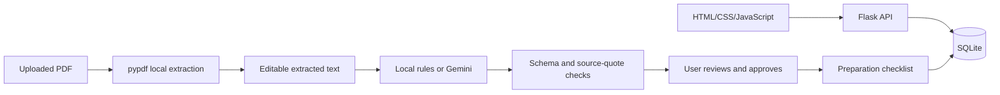

# Fieldnotes — AI-assisted Interview Preparation

A Python/Flask application that turns recruitment documents into **reviewed requirements and personalised preparation tasks**. Built with AI coding assistance from OpenAI Codex. This public edition uses fictional examples and completion templates; it contains no personal CV, recruitment PDFs, credentials or user database.

**Category:** human-in-the-loop, GenAI-powered automated workflow. It is not an autonomous agent or an embedding-based RAG chatbot.

## Problem and workflow

Interview preparation is often split across emails, JDs, answer notes and checklists. Fieldnotes keeps that work together while letting the user verify AI-generated changes.

1. Create a company process and its interview/GD rounds.
2. Upload a JD or recruitment-email PDF. Text extraction runs locally.
3. Review extracted text. Choose local analysis or explicitly request Gemini.
4. Inspect proposed facts and their document/page quotations. Select which updates to apply.
5. Generate preparation tasks using approved requirements, round context and review notes.
6. Edit answers, track completion and record interview reflections.

The answer library has 44 editable topic templates, confidence ratings, revision history and practice timing. Other features include STAR stories, claim verification, printable briefs and JSON/ZIP backups.

## Architecture



Gemini is called server-side with structured prompts and a JSON output schema. Document analysis checks quoted evidence against extracted pages. Preparation generation uses approved requirements and validates referenced IDs. These checks do not prove semantic correctness; human review remains necessary. AI failures use a labelled local fallback, preserving existing work.

## Run locally

Requires Python 3.10+.

```sh
python -m venv .venv
# Windows:
.venv\Scripts\activate
# macOS/Linux: source .venv/bin/activate
pip install -r requirements.txt
python app.py
```

Open **http://127.0.0.1:5050**. On Windows, `run.bat` installs missing dependencies, starts the server and opens the page. Stop any other copy using port 5050 first. Local editing, checklists and PDF extraction work without an API key.

### Optional Gemini configuration

Copy `.env.example` to `.env`. Set `GEMINI_API_KEY` and a currently available text model as `GEMINI_MODEL`. Review privacy and billing notices in Settings before enabling AI. Model availability, quota and pricing depend on your Google project; no paid-model fallback or background AI requests are used. An API key on a billed project can incur charges. Selected document text/context goes to Google only when you explicitly choose Gemini; preview and remove confidential content before sending.

## Validation

```sh
python -m unittest discover -s tests -v
```

Backend tests cover persistence, revisions, conflict detection, duplicate prevention, PDF limits, source validation, migration, backup restoration and mocked Gemini failures. Tests use temporary databases. They do not measure live-model accuracy or user outcomes.

## Product decisions and limitations

- Human approval prevents extracted proposals from silently replacing user decisions.
- Local fallback keeps the core workspace usable during service failures.
- Different requirements remain separate tasks even when linked to the same answer.
- PDF limits: 5 MB, 30 pages, 12 documents per company. Scans need manually supplied text; encrypted PDFs must be unlocked before upload.
- Local document analysis uses patterns; it can miss or misclassify details.
- No embeddings, vector retrieval, autonomous tool execution, OCR or multi-user authentication.
- Intended for a single user on localhost. Do not expose the development server publicly.
- No claims of improved interview selection rates, production scale or measured user impact. A user pilot and labelled AI evaluation are future work.

## Contribution and development approach

The project originated from a user's interview-preparation needs and iterative feature requests. OpenAI Codex provided substantial implementation, debugging and testing assistance. Applicants presenting this project should explain the requirements and decisions they personally owned, demonstrate their understanding of the implementation, and distinguish AI-generated code from work they wrote independently.

See [DEMO.md](DEMO.md) for a reproducible demonstration and [EVALUATION.md](EVALUATION.md) for the proposed evaluation plan. These are documentation, not claimed experimental results.

## Data and repository hygiene

Runtime data stays in `data/`; `.env`, databases, PDFs, logs and backups are ignored by Git. JSON backups contain user text; original PDF bytes are exported separately as ZIP. Never upload either as a public sample. This repository deliberately ships only fictional demonstration data.
